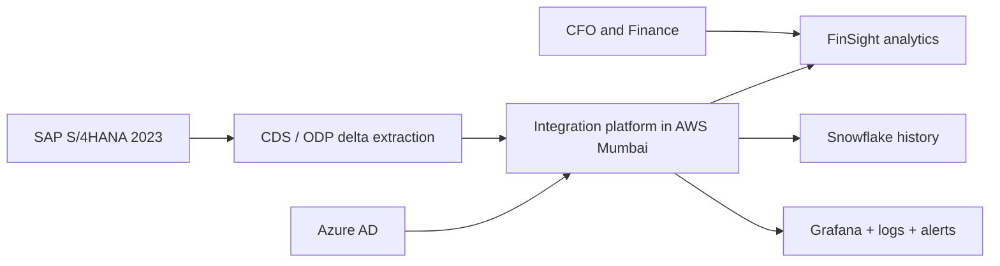

# D1 Integration Architecture

## Objective

Meridian Manufacturing needs financial visibility within four hours instead of the current 24-hour delay. The design moves SAP S/4HANA deltas through a controlled integration layer into FinSight while protecting SAP performance and preserving audit lineage.

## Context

## Containers

1. SAP adapter: polls one provider no more than once per 30 minutes and stores the last committed delta token.
2. Kafka topics: `sap.raw.<domain>`, `transform.validated.<domain>`, and `integration.dlq`; replication factor 3 and encrypted storage.
3. Transformation service: schema validation, normalization, enrichment, GST preservation, fiscal-period mapping, and lineage stamping.
4. FinSight adapter: OAuth client credentials, idempotency keys, rate-limit handling, and bounded retries.
5. Reconciliation service: count, checksum, debit-credit, and referential checks per batch.
6. Operations store: immutable audit events, metrics, structured logs, and DLQ metadata.

## Decisions and constraints

| Decision | Rationale |
| --- | --- |
| Hybrid ODP delta plus scheduled batch | Freshness for high-value data without overloading SAP |
| Kafka with at-least-once delivery | Replayability; idempotent target writes remove duplicate effects |
| AWS Mumbai only | Meets stated data-residency constraint |
| Partition by domain and company code | Isolates failures and supports MC01/MC02/MC03 routing |
| Pause extraction during 01:00-04:30 IST | Avoids conflict with RGGBS000 |
| Maximum 40 active RFC calls | Leaves 10 of the 50-call allocation for SAP users and recovery |

## SLOs

- 98% of successful batches complete within the four-hour freshness window.
- P95 FinSight request latency below five seconds.
- 100% of accepted records have source lineage and an idempotency key.
- Zero unreconciled debit-credit variance for a batch marked `RECONCILED`.
